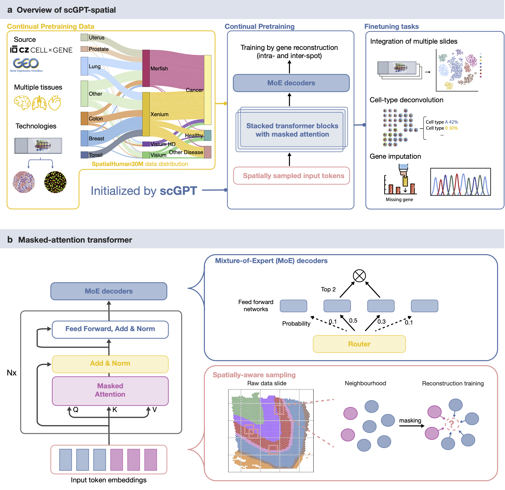

## scGPT-spatial: Continual Pretraining of Single-Cell Foundation Model for Spatial Transcriptomics

### 🟩 </ins>TL,DR Highlights 🟩

✨ Continual pretraining ✨ of scGPT (scRNA-seq foundation model) on 30 million spatial-omic corpus

✨ Novel MoE (Mixture of Experts) decoders ✨ for gene expression generation

✨ Spatially-aware sampling ✨

✨ Neighborhood-based masked reconstruction objective ✨ 

✨ Curation of *SpatialHuman30M* corpus ✨ with Visium, Visium HD, Xenium, and MERFISH data

### 🟫 Model Weights 🟫

scGPT-spatial V1 weights on [figshare](https://figshare.com/articles/software/scGPT-spatial_V1_Model_Weights/28356068?file=52163879).

### 🟦 Setup and Tutorials 🟦
Special acknowledgement to the scGPT codebase - for environment setup please follow [instructions](https://github.com/bowang-lab/scGPT) there.

Check out our zero-shot inference [tutorial](https://github.com/bowang-lab/scGPT-spatial/tree/main/tutorials) on github! More code coming soon.

### 🟪 Preprint and Citation 🟪

Check out our preprint!

